<p align="center">
  <picture>
    <source media="(prefers-color-scheme: dark)" srcset="banner/output/dark.svg">
    <source media="(prefers-color-scheme: light)" srcset="banner/output/light.svg">
    
  </picture>
</p>

## ⚙️ About & Engineering Focus

Final-year Computer Science & Engineering student at **Ajay Kumar Garg Engineering College (AKGEC)** focusing on **Backend Engineering, Distributed Systems, and Developer Infrastructure**.

I design and build production-grade web applications, fault-tolerant backend services, resilient payment systems, and cloud-native solutions. My focus is on writing clean, scalable code, understanding lower-level system internals, and applying strong computer science fundamentals.

- **Current Pursuits:** Distributed Systems Architecture, Kubernetes Orchestration, High-Throughput Message Queues, and AI/ML RAG Pipelines.
- **Core Methodology:** Modular design, strict API contracts, robust error handling, and performance optimization.

---

## 🛠️ Technical Stack & Capabilities

```text
┌──────────────────────────────────────────────────────────────────────────────────────────┐
│ LANGUAGES          C++ · Python · TypeScript · JavaScript                               │
│ BACKEND & APIS     Node.js · Express.js · REST APIs · WebSockets · gRPC                  │
│ DATABASES & CACHE  PostgreSQL · MongoDB · Redis · Prisma ORM                              │
│ INFRA & DEVOPS     Linux (Arch) · Docker · Kubernetes · AWS (EC2/ECR) · Nginx · CI/CD    │
│ CS FUNDAMENTALS    Data Structures & Algorithms · Operating Systems · DBMS · Computer Net │
└──────────────────────────────────────────────────────────────────────────────────────────┘
```

---

## 🚀 Featured Engineering Projects

### 🛡️ [PayShield](https://github.com/mayank-tripathi-dev/PayShield) `FLAGSHIP`
**AI-Powered Payment Infrastructure & Resilience Engine**
* High-throughput payment processing architecture designed to handle transaction retries, idempotency protection, and fraud mitigation for MSMEs and fintech platforms.
* **Tech Stack:** Node.js, Express, PostgreSQL, Redis, Kafka, Docker, Kubernetes, Prometheus, Grafana, AI/ML.
* **Key Highlights:** Smart retry scheduling, AI-assisted anomaly & fraud detection, distributed lock-based idempotency layer, real-time observability metrics.

### 📄 [AI Doc Assistant](https://github.com/mayank-tripathi-dev/ai-doc-assistant)
**Document Intelligence & Retrieval-Augmented Generation (RAG) System**
* Modular multi-service application with decoupled Node.js API orchestrator, React frontend, and dedicated Python RAG service for intelligent document analysis and querying.
* **Tech Stack:** TypeScript, React, Node.js, Python, Vector Embeddings, Fast-RAG service.
* **Key Highlights:** Sub-second document chunk vector indexing, context-aware semantic search, clean REST API boundaries.

### 🌐 [Personal Developer Portfolio](https://portfolio-five-psi-3qupggxm2h.vercel.app/)
**Engineering Portfolio & Interactive Showcase**
* Modern showcase application highlighting architecture decisions, project breakdowns, technical blog posts, and interactive UI components.
* **Tech Stack:** Next.js, React, TypeScript, Tailwind CSS.

### 🔨 [SkillForge](https://github.com/mayank-tripathi-dev/skillforge-course-platform)
**Course Platform & Scalable LMS Backend**
* Full-stack course management platform featuring role-based access control (RBAC), secure JWT authentication, and scalable MongoDB schema design.
* **Tech Stack:** Node.js, Express, MongoDB, Mongoose, JWT, React.

### 🧠 [BrainWave](https://github.com/mayank-tripathi-dev/brainwave-knowledge-platform)
**Knowledge Base & Second Brain Platform**
* High-performance web application designed for organizing, tagging, and retrieving knowledge documents and links.
* **Tech Stack:** React, TypeScript, Vite, Tailwind CSS.

### 🎨 [SketchFlow](https://github.com/mayank-tripathi-dev/sketchflow-drawing-platform)
**Real-Time Interactive Canvas & Infinite Workspace**
* Infinite canvas drawing platform built with high-performance 2D rendering loops and viewport scaling matrices.
* **Tech Stack:** React, TypeScript, HTML5 Canvas API, Custom Viewport Engine.

---

## 📊 Analytics & Performance

<p align="center">
  
</p>

<p align="center">
  
  
</p>

---

## 🐍 Contribution Graph

<p align="center">
  <picture>
    <source media="(prefers-color-scheme: dark)" srcset="https://raw.githubusercontent.com/mayank-tripathi-dev/mayank-tripathi-dev/output/github-snake-dark.svg">
    <source media="(prefers-color-scheme: light)" srcset="https://raw.githubusercontent.com/mayank-tripathi-dev/mayank-tripathi-dev/output/github-snake.svg">
    
  </picture>
</p>

---

## 📬 Connect & Social Links

<p align="center">
  <a href="https://www.linkedin.com/in/mayank-tripathi-b84525318/">
    
  </a>
  <a href="https://portfolio-five-psi-3qupggxm2h.vercel.app/">
    
  </a>
  <a href="mailto:mayank.tripathi.dev18@gmail.com">
    
  </a>
  <a href="https://leetcode.com/u/BitwiseMayank/">
    
  </a>
  <a href="https://x.com/mayanktripa">
    
  </a>
  <a href="https://www.instagram.com/mayank_kumar_tripathi_/">
    
  </a>
</p>
